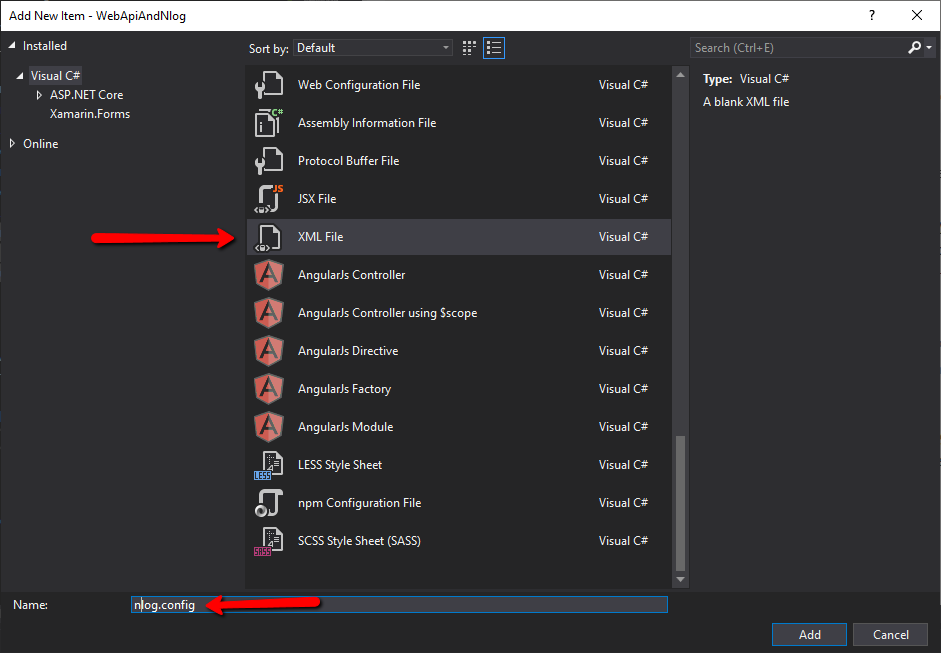
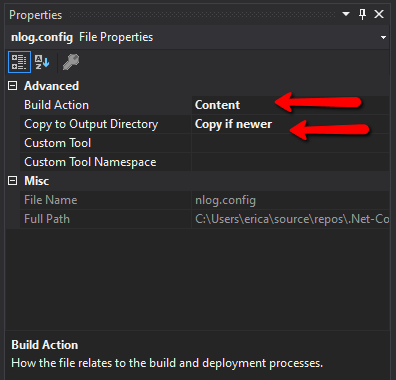
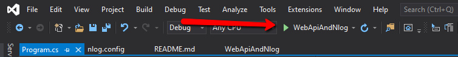
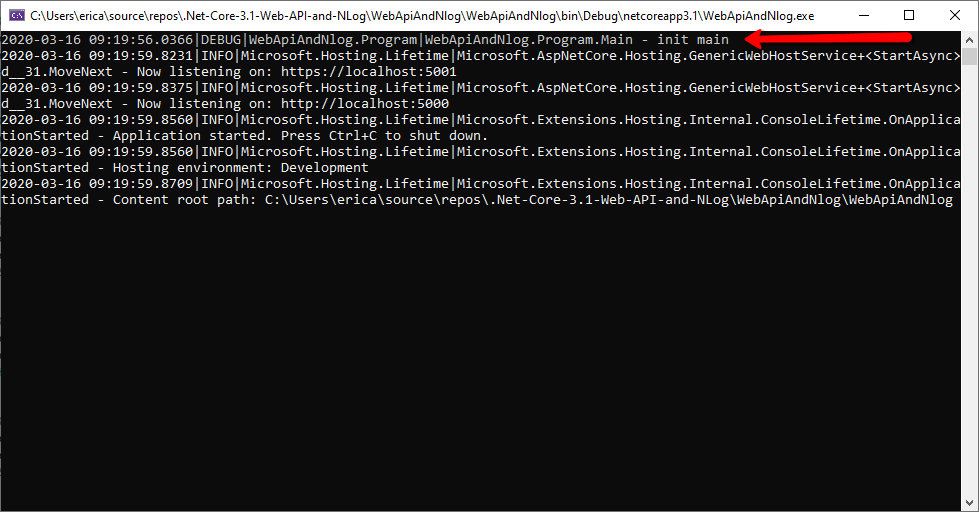
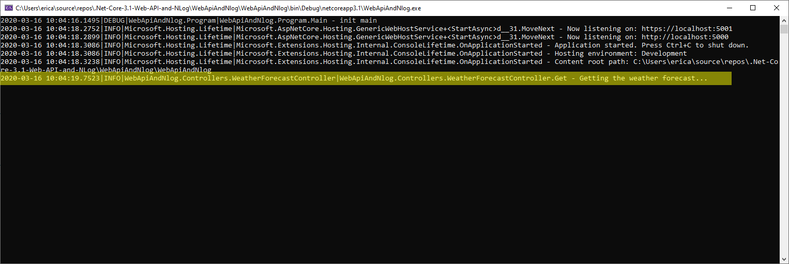

# .Net-Core-3.1-Web-API-and-NLog
There are several popular logging frameworks available for c#, but 
[Nlog](https://nlog-project.org/) is my favorite. It's versatility 
and ease of configuration make it my number one choice for logging.

##### Why Log
Logging is critical to debugging problems in a production 
environment. Log files are often 
your only window into your application's performance. 
This is especially true if your application doesn't have an UI,
like a windows service or a console app that runs a scheduled task.

##### Why use a logging framework
Logging frameworks are written so that they never interfere with the 
normal operation of the app. Another way to put this is that while the
logging framework may not work correctly, it won't crash your app.
Logs follow a basic and simple format:

```
DATE AND TIME | LOG LEVEL | MESSAGE
```
###### Log levels 
Log levels give us a way to logically group our messages. 

| Level | Typical Use |
| ------- | ------------ |
| Fatal	| Something bad happened; application is going down; aka Critical |
| Error	| Something failed; application may or may not continue |
| Warn	| Something unexpected; application will continue |
| Info	| Normal behavior like mail sent, user updated profile etc. |
| Debug	| For debugging; executed query, user authenticated, session expired |
| Trace	| For trace debugging; begin method X, end method X |

Logging frameworks really allow us to take advantage of these log levels.
We can turn "the noise" in our logs up and down at will via a config
file. We can also control how much is logged to each log source.
Logging frameworks also greatly expand our logging sources.

##### Installing NLog
Since NLog is a [nuget package, installation](https://docs.microsoft.com/en-us/nuget/consume-packages/install-use-packages-visual-studio) is a snap:

```
Install-Package NLog.Web.AspNetCore
```

##### Configuring NLog
The next step is to create an NLog config file. The config file basically
has 4 sections:

1. Nlog config - nlog settings
2. Extensions - If you wanted to log to SQL, Redis, etc you'll add those extensions here.
3. Targets - Targets are where the log file goes. File, Console, SQL etc.
4. Rules - Rules control how much gets logged in each target

Here is my default NLog.config file:

``` xml
<?xml version="1.0" encoding="utf-8" ?>
<nlog xmlns="http://www.nlog-project.org/schemas/NLog.xsd"
      xmlns:xsi="http://www.w3.org/2001/XMLSchema-instance"
      xsi:schemaLocation="http://www.nlog-project.org/schemas/NLog.xsd NLog.xsd"
      autoReload="true"
      throwExceptions="false"
      internalLogLevel="off" 
      internalLogFile="nlog-internal.log">

  <!-- enable asp.net core layout renderers -->
  <extensions>
    <add assembly="NLog.Web.AspNetCore"/>
  </extensions>

  <targets>
    <target name="console" xsi:type="ColoredConsole" layout="${longdate}|${level:uppercase=true}|${logger}|${callsite} - ${message}" />
    <target name="file" xsi:type="File"
      layout="${longdate}|${level:uppercase=true}|${logger}|${callsite} - ${message}"
      fileName="log.log"
      archiveFileName="archives/log.{##}.log"
      archiveEvery="Day"
      archiveNumbering = "Rolling"
      maxArchiveFiles="7"
      concurrentWrites="true"
      keepFileOpen="false" />
  </targets>

  <rules>
    <!-- Define where to write the errors -->
    <logger name="*" minlevel="Trace" writeTo="console,file" />
  </rules>
  
</nlog>
```

In my nlog settings the most important settings are the `internalLogLevel`
and `internalLogFile`. These are the settings you'll use to troubleshoot nlog. 
If nlog is not working and you're not getting any logs
you'll set the file to a location on your drive and the loglevel to
`trace`. One view of this log is usually enough to tell you where things
went wrong.  
Next come the extensions, in this example I am only logging to
file and console so the only entry here is for nlog itself.  
After extensions, come the targets. I have only two targets file and console.
As you can see each of these can be configured seperately. They also
have different settings available depending on the [target](https://nlog-project.org/config/?tab=targets) you choose.
For my file logger you can see that I have added archive settings that
allows nlog to take care of rotating my log files.  
> **TIP**: Give all your log files a common unique extension. This will allow you 
> to add exceptions in your backup systems so that logs could be skipped.
> In many cases log files are not important but could trigger many 
> incremental backups.

Lastly comes the rules section of the config. I usually start by logging 
everything to both the console and the file. As I move to production
then I change the rules so I only log errors to file.

To create my nlog config file I right-click the project choose add and
then new item. The I choose xml file and name it `nlog.config`.



The next thing we need to do is to make sure our nlog.config file is
included in our published files. We select the file and set 
the properties. We set `build action` to `content` and 
`copy to output directory` to `Copy if newer`. 



Now we need to wire up nlog in our `Program.cs` file.
We'll replace this:

``` csharp
public static void Main(string[] args)
{
  CreateHostBuilder(args).Build().Run();
}
```

with this:

``` csharp
public static void Main(string[] args)
{
    var logger = NLog.Web.NLogBuilder.ConfigureNLog("nlog.config").GetCurrentClassLogger();
    try
    {
        logger.Debug("init main");
        CreateHostBuilder(args).Build().Run();
    }
    catch (Exception exception)
    {
        //NLog: catch setup errors
        logger.Error(exception, "Stopped program because of exception");
        throw;
    }
    finally
    {
        // Ensure to flush and stop internal timers/threads before application-exit (Avoid segmentation fault on Linux)
        NLog.LogManager.Shutdown();
    }
}
```

Then we'll replace this:

``` csharp
public static IHostBuilder CreateHostBuilder(string[] args) =>
    Host.CreateDefaultBuilder(args)
        .ConfigureWebHostDefaults(webBuilder =>
        {
            webBuilder.UseStartup<Startup>();
        });
```

with this:

``` csharp
public static IHostBuilder CreateHostBuilder(string[] args) =>
    Host.CreateDefaultBuilder(args)
    .ConfigureWebHostDefaults(webBuilder =>
    {
        webBuilder.UseStartup<Startup>();
    })
    .ConfigureLogging(logging =>
    {
        logging.ClearProviders();
        logging.SetMinimumLevel(Microsoft.Extensions.Logging.LogLevel.Trace);
    })
    .UseNLog();  // NLog: Setup NLog for Dependency injection
```
Then we just need to add a using statement for nlog:

``` chsarp
using NLog.Web;
```


This should be
all of the setup that is necessary to begin using nlog.  
Now I can change my launch profile from IIS Express to
the one that is my application name and see the results.



Once I do this then the app will launch with a console 
where we will be able to see the "init main" message
that we created when we declared the line:

``` csharp
logger.Debug("init main");
```



Of course you can see that all of the messages on the console
conform to the format we defined in our config file.
Now I can change my waether forcaset to something like this:

``` csharp
[HttpGet]
public IEnumerable<WeatherForecast> Get()
{
    try
    {
        _logger.LogInformation("Getting the weather forecast...");
        var rng = new Random();
        return Enumerable.Range(1, 5).Select(index => new WeatherForecast
        {
            Date = DateTime.Now.AddDays(index),
            TemperatureC = rng.Next(-20, 55),
            Summary = Summaries[rng.Next(Summaries.Length)]
        })
        .ToArray();

    }
    catch (Exception e)
    {
        _logger.LogError(e.ToString());
        throw;
    } 
}
```



That's it. Nlog is enabled and now you can use it to help
monitor your application in production. Place your logging
in your app strategically. Really take advantage of the
various log levels to get the right balance of messages
in your apps.
